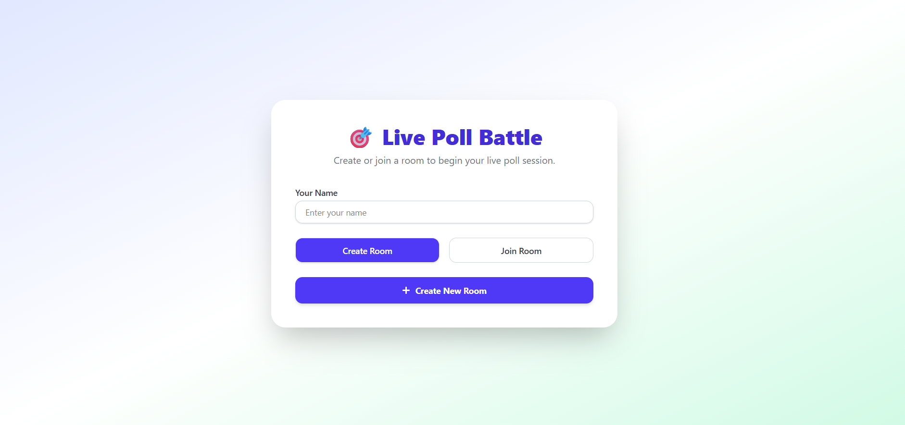
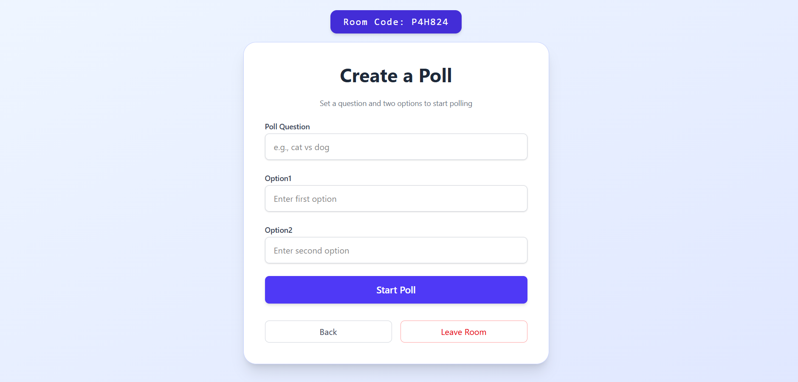
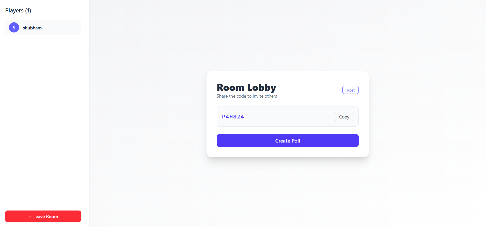
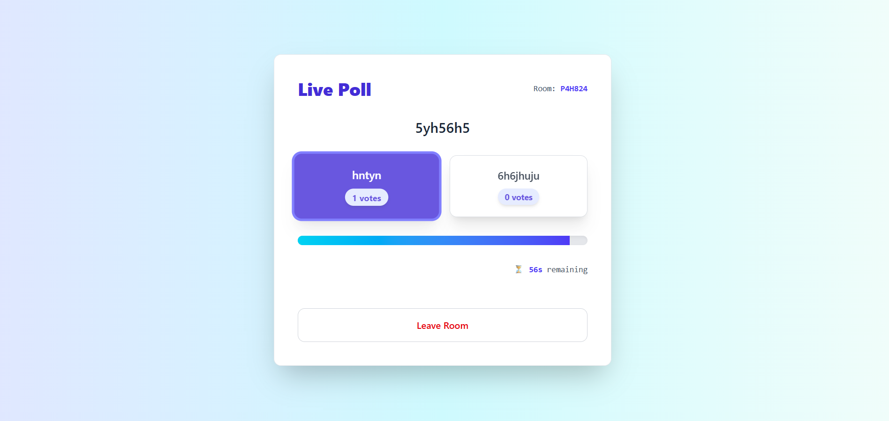

# ⚔️ Poll-Battel - Engage in Real-time Poll Battles!

[](https://opensource.org/licenses/MIT)
[](https://render.com)
[](https://render.com)
[](https://poll-battel-1.onrender.com/)

**Poll-Battel** is a real-time interactive polling web app where users can create or join polls, vote anonymously using a custom username, and view live results instantly. Designed for engagement, quick feedback, and fast decisions, it’s perfect for online teams, classrooms, or fun group activities.

🔥 **Try it Live:** [https://poll-battel-1.onrender.com/](https://poll-battel-1.onrender.com/)

---

## 🎯 Features

- ✅ Real-time voting with WebSocket
- ✅ Anonymous voting using custom usernames
- ✅ Join polls via unique room codes
- ✅ Countdown timer to automatically close polls
- ✅ Responsive, mobile-first UI using Tailwind CSS
- ✅ Live result updates as users vote

---

## 🧱 Tech Stack

### 🔹 Frontend

- React (Vite)
- Tailwind CSS
- React Icons
- React Hot Toast

### 🔸 Backend

- Node.js
- WebSocket (`ws`)
- Render for deployment

---

## 📁 Directory Structure

```bash
Poll-Battel/
│
├── client/                # Frontend
│   ├── public/            # Static files and images
│   └── src/
│       ├── components/    # React components 
│       ├── context/       # Global state/context providers
│       ├── hooks/         # Custom React hooks
│       └── App.jsx        # Main application entry
│
├── server/                # WebSocket backend
│   └── index.js           # Entry point for Node.js server
│
├── package.json           # Monorepo dependencies
└── README.md              # This documentation
```
## screenshots of pages
Login Page



Create Poll




Room Code



Poll View




---

## 🛠️ Setup Instructions

### 1. Clone the Repository

```bash
git clone https://github.com/shubm18/Poll-Battel
cd PollRoom
```

### 2. Run Locally

#### Backend (Node.js WebSocket)

```bash
cd server
npm install
node index.js       # Runs on ws://localhost:3001
```

#### Frontend (React + Vite)

```bash
cd client
npm install
npm run dev         # Runs on http://localhost:5173
```

🔗 **WebSocket Configuration**

```js
// In client/src/App.jsx
const WS_URL = window.location.hostname === 'localhost'
  ? 'ws://localhost:8080'
  : 'wss://pollroom.onrender.com';
```

---

## 📄 License

This project is licensed under the MIT License. See [LICENSE](LICENSE) for details.
